# KDT5-MINI with backend

## 프로젝트 소개

본 웹 어플리케이션은 50명 내외의 중소기업에서 사용하는 연차/당직 관리 프로그램입니다.

패스트캠퍼스 백엔드 5기 3분과 팀을 이루어 협업을 진행하였으며 백앤드와의 첫 협업 프로젝트입니다.

[결과물 보러가기](https://kdt-5-mini-team-11-eifz.vercel.app/)

## 11조 개쩌는팀 소개

| 팀원 |      박진영      |         남기훈         |           이정우           | 성규창 | 김용원 | 배종윤 |
| :--: | :--------------: | :--------------------: | :------------------------: | ------ | ------ | ------ |
| 담당 | 내계정<br>관리자 | 회원가입<br>캘린더<br> | 인증인가<br>연차/당직 신청 | 백엔드 | 백엔드 | 백엔드 |

<br><br>

## 사용한 기술, 라이브러리

### Environment

<br>
<br>
<br>

### Config

<br>
<br>

### Frontend

<br>
<br>
 <br>
 <br>

### Backend

<br>
<br>

### Co-work

<br>
<br>
<br>

## 화면 구성

### 로그인

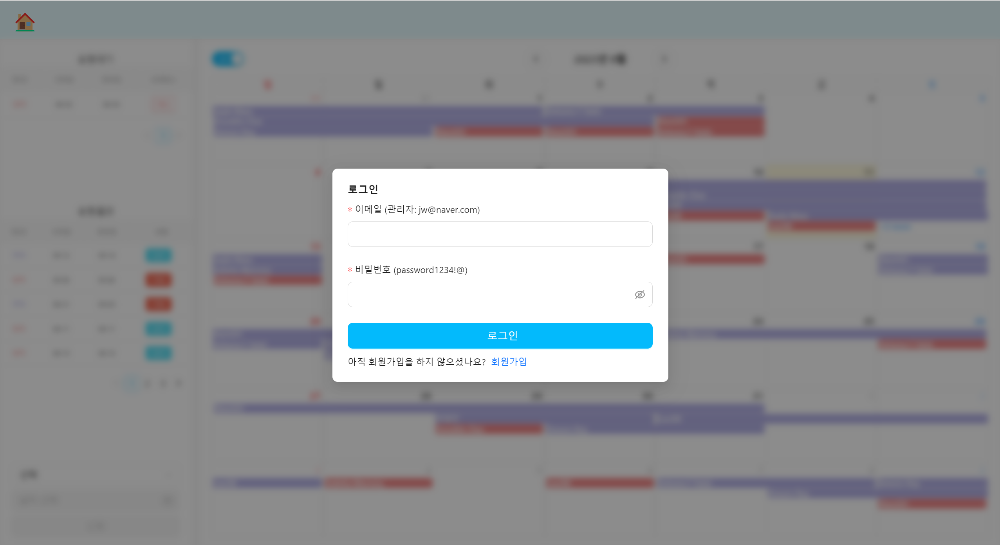

- 사내에서 사용하는 프로그램으로 반드시 로그인이 필요하다.
  - 로그인, 회원가입 페이지를 제외한 모든 페이지는 protected route
- 로그인 창을 모달화하였으며 외부 배경을 blur 처리
- 회원가입 버튼을 눌러 회원가입페이지로 이동

<hr>

### 회원가입

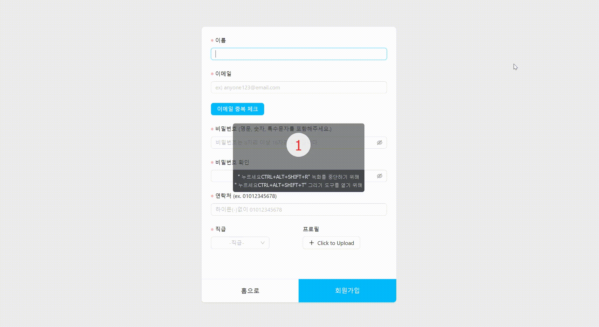

- 입력 항목별 유효성 검사
  - 이메일, 비밀번호 regex 검사
  - 클라이언트 및 서버모두 동일하게 유효성 검사 진행
- 이메일 중복 체크 이후에 이메일 인증해야 회원가입을 할 수 있다.

<hr>

#### 메인 화면

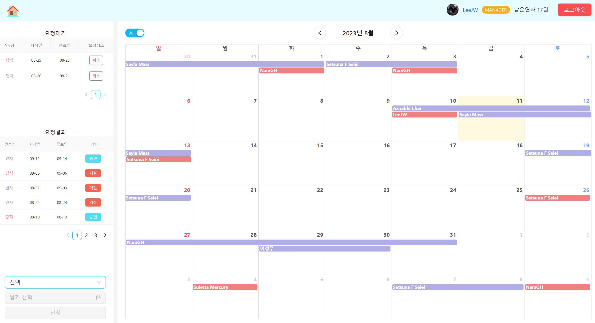

- 사이드바에서 내가 신청한 연차/당직 목록을 확인 할 수 있다.
- 사이드바에서 새로운 연차/당직을 신청할 수 있다.
  - 신청한 연차/당직은 대기 상태로 등록이 되며 관리자가 승인 또는 거절을 한다.
  - 심사중인 연차/당직은 취소가 가능하다.
- 우측 상단에 간략한 사용자의 정보 및 로그아웃 버튼이 있다.
- 달력에는 모든 사원들의 승인된 일정이 표시된다.
- 달력 좌측 상단의 Switch 버튼을 눌러 내 일정만을 볼 수 있다.

<hr>

#### 내 정보 페이지

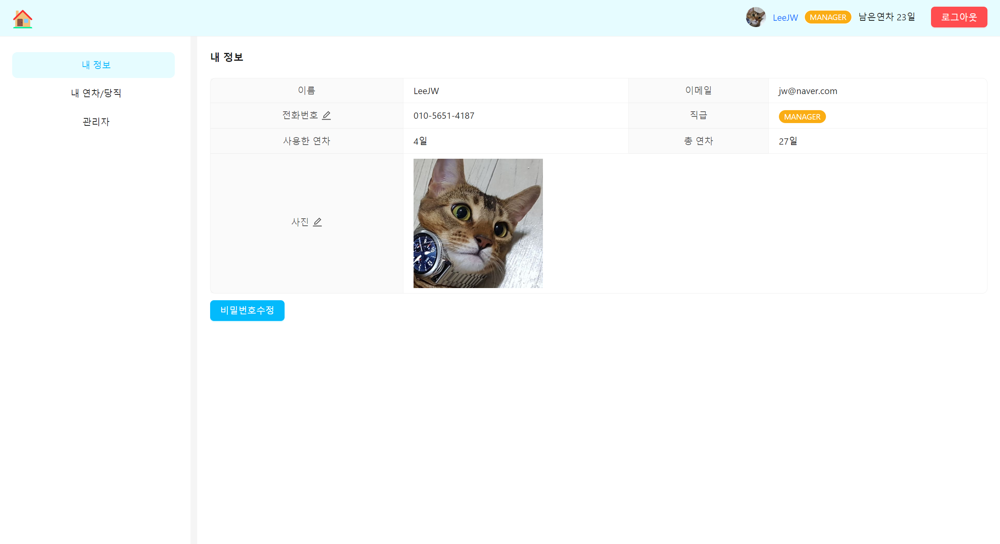

- 내 정보와 수정이 가능한 항목을 수정 할 수 있다.
- 유효성 검사 결과와 등록 결과 등을 팝업 메세지로 사용자에게 알려준다.
<hr>

#### 내 연차/당직 페이지

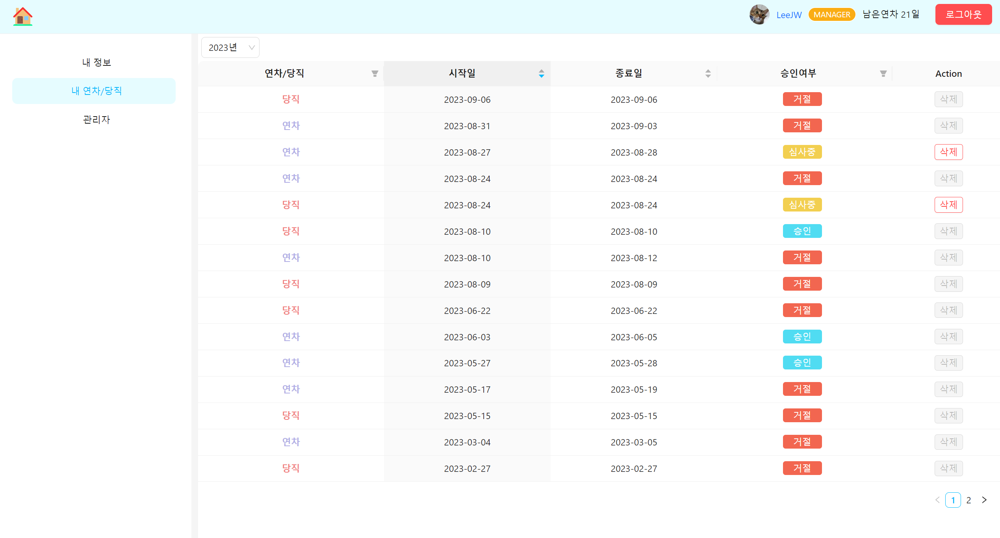

- 사용자가가 신청한 연차/당직 정보를 확인할 수 있다.
- 심사 중인 연차/당직은 삭제가 가능하다.
- 거절된 연차/당직은 삭제가 불가능하다.
- 승인된 연차/당직은 삭제가 가능하다.
- 과거의 연차/당직은 삭제가 불가능하다.
- 연차/당직 테이블은 시작/종료일 오름차, 내림차 그리고 승인여부에 따라 정렬 할 수 있다.

<hr>

#### 관리자 연차/당직 승인 페이지

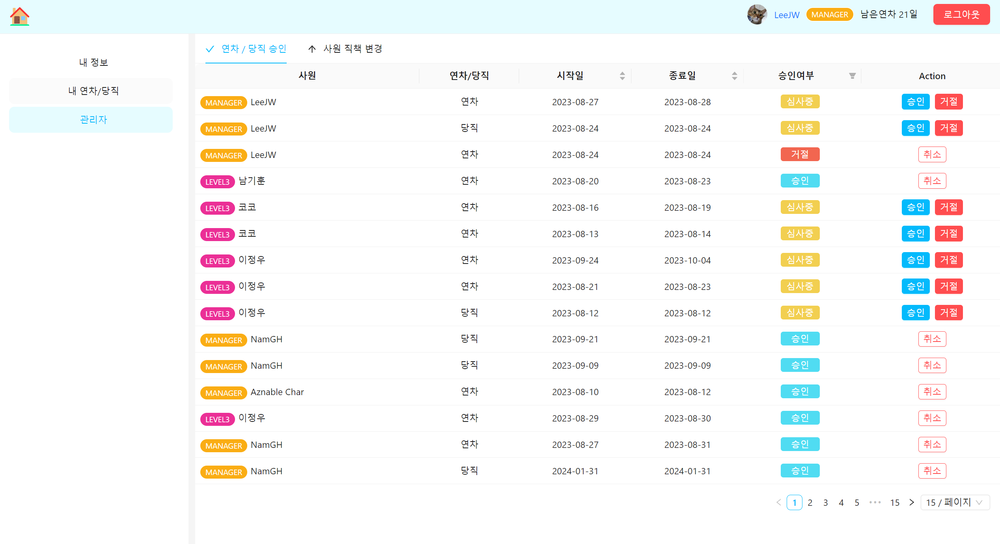

- 관리자는 모든 사원의 연차/당직 신청을 승인, 거절, 취소할 수 있다.
- 일반사용자의 경우 `관리자`가 메뉴가 보이지 않으며 라우팅 설정으로 인해 접근이 제한된다.
- 연차/당직 테이블은 시작/종료일 오름차, 내림차순 그리고 승인여부에 따라 정렬 할 수 있다.

<hr>

#### 관리자 사원 직책 변경 페이지

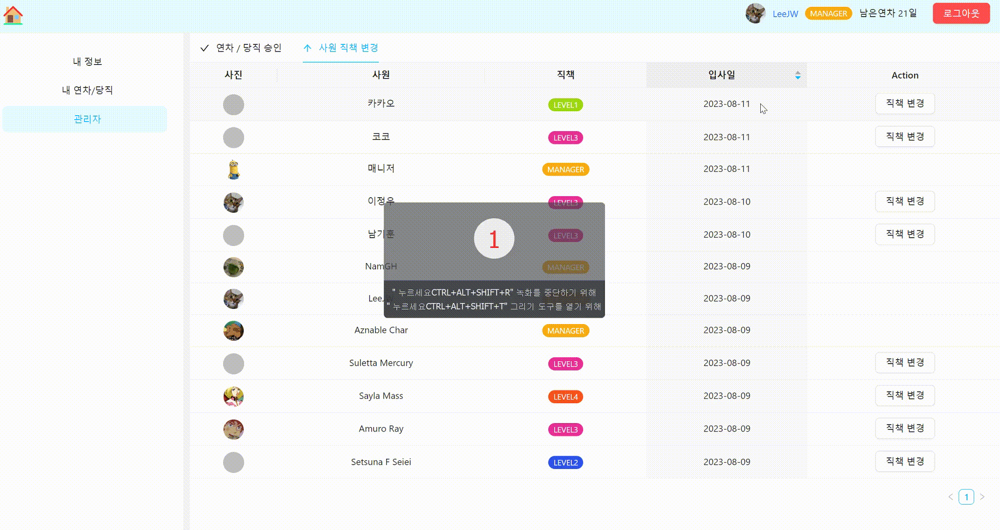

- 관리자는 사원의 직책을 변경할 수 있다.
- 입사일 오름차, 내림차로 정렬 할 수 있다.

<hr>

## 고찰

### 협업

- 처음으로 백엔드와 협업을 진행<br><br>
- 백엔드는 프론트 지식이 프론트는 백엔드 지식이 부족한 관계로 초반 소통과정이 원활하지 않음<br><br>
  - <b>가장 중요한 것은 소통</b>, 지식 간극을 적극적인 소통으로 줄여나감
  - data base, 네트워크 통신, 보안에 대한 추가적인 공부가 필요함<br><br>
- 노션, 슬랙, 줌, 피그마 툴을 사용

  - 노션 : API 명세서

    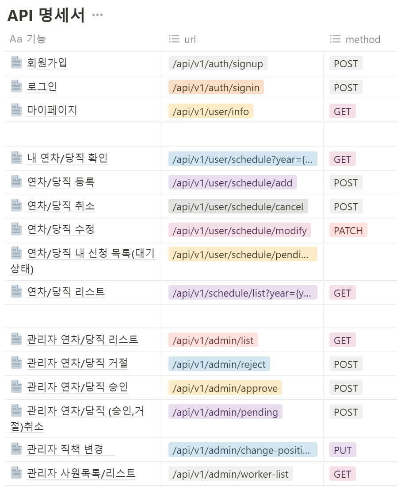
    <br><br>

  - 슬랙 : 텍스트 형식의 소통

    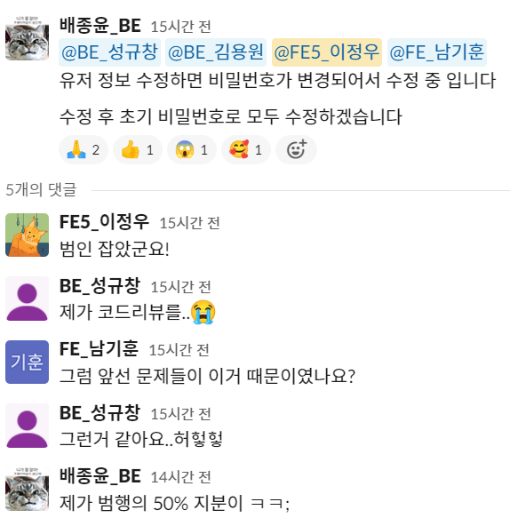
    <br><br>

  - 줌 : 영상, 음성 형식의 실시간 소통

    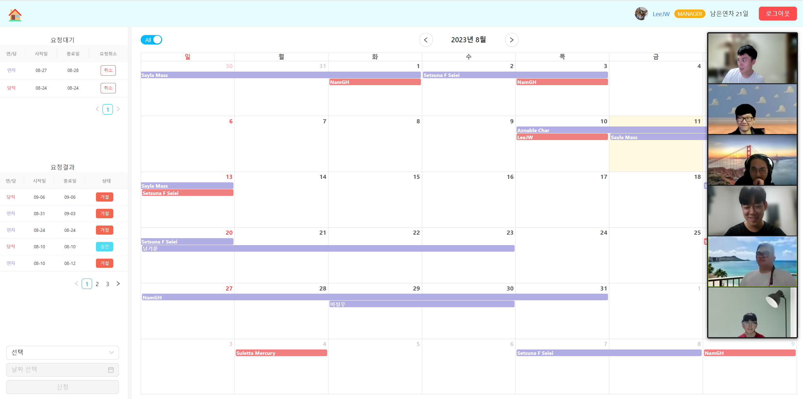
    <br><br>

  - 피그마 : 와이어프레임 작성

    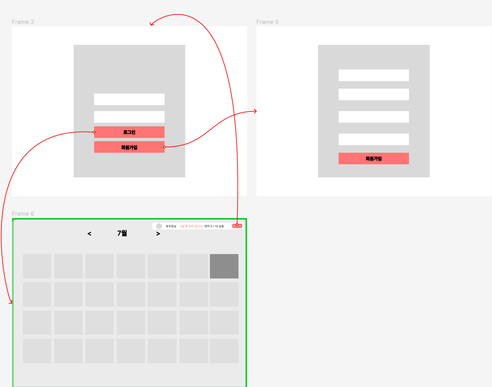
    <br><br>

### 통신 최소화 및 최적화

- 통신이 필요한 부분에서 필요한 정보만을 가져오는 것을 목표로 하였다.
  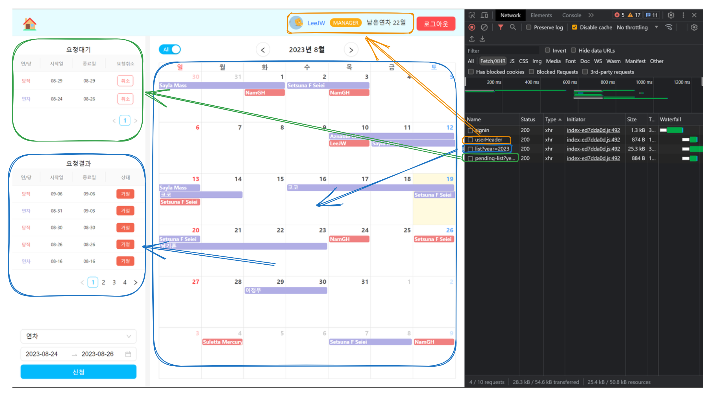

  - 로그인 POST 요청시 다른 정보 없이 accessToken만을 받는다. (로컬 환경에서는 refreshToken도 받는다)
  - userHeader요청의 응답은 아래와 같으며 불필요한 데이터(예를 들어 userEmail)가 없고 클라이언트에서 실제로 사용하는 데이터만을 담고 있다.

  ```js
  {
    "success": true,
    "response": {
        "userName": "LeeJW",
        "userEmail": "jw@naver.com",
        "position": "MANAGER",
        "profileThumbNail": "http://res.cloudinary.com/namkihun/image/upload/v1692119952/jgcb1l8klznlcpm6pc3f.png",
        "usedVacation": 5
    },
    "error": null
  }
  ```

  - 달력에 표시되는 모든 사원의 연차/당직 데이터는 1년치이다. 달력에서는 `요청대기상태의 연차/당직 데이터`가 필요 없기 때문에 해당 요청의 응답에는 `요청대기 연차/당직 데이터`는 포함되어있지 않다.

    - 좌측 사이드바 상단의 사용자의 요청 대기 연차/당직 데이터는 별도의 GET요청을 통해 받는다.
    - 좌측 사이드바 하단의 사용자의 연차/당직 요청결과 데이터는 모든 사원의 연차/당직 데이터 내에 포함되어 있으므로 별도의 요청없이 필터링하여 사용한다. <br/><br/>

  - 한달치 데이터 받기 vs 1년치 데이터 받기
    - 한달치 데이터를 받는 경우
      - 달력에서 월을 이동 할 때마다 통신이 발생한다.
      - 이전달의 후반부(최대 6일)와 다음달의 전반부(2월은 최대 14일)가 달력에 표시된다.
      - 필요한 데이터를 동적으로 예측하는 것을 불가능에 가깝기 떄문에 해당월 + 전달 마지막 6일 + 다음달 14일 데이터를 요청해야 한다. 따라서 한번 요청에 해당월 + 20일치가 추가 되므로 매우 비효율적이다.
    - 1년치 데이터를 받는 경우
      - 달력에서 년이 바뀔 때 통신이 발생한다.
      - 이전달 후반부 다음달 전반부를 신경쓰지 않고 이전년도 12월 26일 ~ 31일, 다음 년도 1월 1일 ~ 11일만 추가적으로 보내주면 된다.
      - 회사 규모가 클경우 1년치 데이터를 로딩하는데 많은 시간이 소요 될 수 있다.

### AccessToken & RefreshToken, HttpOnly 쿠키, Axios Interceptor

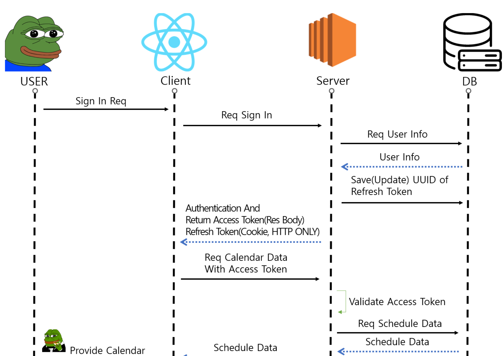

- Authorization

  - 사용자가 로그인을 요청을 보내면 서버에서 accessToken은 res.body에 담아서 보내고, refreshToken은 Http Only 쿠키로 보낸다.<br><br>

- Athentication

  - 로그인한 사용자가 요청을 보낼 때 header에 accessToken을 담아 보낸다.
  - Axios interceptor를 이용하면 accessToken이 필요한 모든 요청들에 토큰을 담아 보낼 수 있다.<br><br>

  ```js
  export const customAxios = axios.create({
    baseURL: BASE_API_URL,
    timeout: 5000,
  });

  customAxios.interceptors.request.use(
    async (req) => {
      const accessToken = getAccessTokenFromCookie();
      if (!accessToken) {
        return req;
      }
      req.headers.Authorization = `Bearer ${accessToken}`;
      return req;
    },
    (error) => {
      return Promise.reject(error);
    },
  );
  ```

- AccessToken이 만료 된 경우

  - accessToken이 만료 된 경우 서버에서는 401 상태메세지를 보내고 이를 Axios interceptor로 가로채 새로운 accessToken을 요청하는 로직을 구현할 수 있다.

  ```ts
  // 여러개의 요청이 밀렸을 경우 리프레시토큰 api가 여러번 실행되는 것을 막는 flag
  let isRefreshing = false;

  // 만료된 토큰으로 인해 pending상태가 된 기존의 요청들을 배열에 담음, 새로운 토큰이 발행되면 이들 요청을 진행
  let refreshSubscribers: ((accessToken: string) => void)[] = [];

  customAxios.interceptors.response.use(
    (response) => {
      return response;
    },
    async (error) => {
      const status = error.response?.data.error.status;

      if (status === 401) {
        if (!isRefreshing) {
          isRefreshing = true;

          try {
            const response = await axios(
              `${BASE_API_URL}/v1/auth/refresh-token`,
              {
                withCredentials: true,
              },
            );

            if (response.status === 200) {
              setAccessTokenToCookie(response.data.response.accessToken);

              const config = error.config;
              config.headers.Authorization = `Bearer ${response.data.response.accessToken}`;
              config.withCredentials = true;

              const retryOriginalRequest = new Promise((resolve) => {
                resolve(axios(config));
              });

              isRefreshing = false;

              refreshSubscribers.forEach((callback) =>
                callback(response.data.response.accessToken),
              );
              refreshSubscribers = [];

              return retryOriginalRequest;
            }
          } catch (error) {
            deleteAccessTokenFromCookie();
            isRefreshing = false;
            return Promise.reject(error);
          }
        } else {
          return new Promise((resolve) => {
            refreshSubscribers.push((accessToken: string) => {
              error.config.headers.Authorization = `Bearer ${accessToken}`;
              resolve(axios(error.config));
            });
          });
        }
      } else {
        return Promise.reject(error);
      }
    },
  );
  ```

- HttpOnly 쿠키

  - 401응답을 받은 클라이언트는 accessToken 재발급을 위해 "/v1/auth/refresh-token" GET요청을 보낸다. 이 때 refreshToken은 이미 쿠키에 담겨있다.
  - HttpOnly 쿠키는 클라이언트측에서 자바스크립트로 접근 할 수 없으므로 XXS와 같은 공격을 무력화 시킨다.
  - `withCredentials`를 `true`로 설정해야 한다.
    httpOnly 쿠키를 사용하기 위해서는 클라이언트 배포 주소와 서버 배포 주소가 모두 SSL인증서를 필요로 한다.
    - 서버에서는 무료 dns와 SSL인증서를 발급 받아서 해결
    - 클라이언트는 vecel로 배포시 https로 배포가 되므로 따로 작업을 필요로 하지 않는다.
    - 그러나 로컬 환경에서 테스트를 할 때는 `http://localhost:5173` 이므로 배포 환경과 로컬 환경에서의 api를 분리하여서 작업하였다.
    - 본 리포지토리는 로컬용이다.

### 놓친 부분, 개선 할 부분

- 다음년도에 예정된 연차을 신청하고자 할 경우 올해 사용가능한, 연차에서 차감되는 문제가 발생한다.

  - 설계단계에서의 오류로 db 스키마 수준에서 수정이 필요하며 마무리 단계에서 발견이 된 관계로 수정하지 못했다.
  - 12월 말 ~ 다음년도 1월에 걸친 연차를 신청했을 경우 12월 연차는 올해에서 차감이되고 1월로 이어지는 연차는 내년 연차에서 차감을 시켜야하는 경우도 생각을 해야함<br/><br/>

- 매니저가 연차/당직의 승인 및 거절을 하였을 때 신청자는 이를 실시간으로 알 수 없다.
  - 해보지 않았지만 websocket을 사용하면 이러한 문제를 해결 할 수 있을 것 같다.
  - 현재 실력으로는 useEffect + setInterval을 사용하여 주기적으로 업데이트 된 데이터를 가져오는 방법을 사용해 볼 수 있다.

### 외부 서비스 (cloudinary)

- 백엔드의 부담을 줄이기 위해 프로필 이미지를 AWS S3에 저장하는 것이 아닌, 업로드한 프로필 이미지를 `cloudinary` 서비스를 이용하여 이미지의 url만을 저장하는 방식을 취함.
  - 프로젝트 기획 단계에서 프로필 이미지를 url형식으로 가져와서 사용하기로 했는데, cloudinary라는 외부 서비스를 같은 팀원인 정우님의 추천으로 사용하게 되었고, 초기 과정에서 cloudinary를 사용하기 위해서 주말 이틀을 꼬박 ant design upload ui에 cloudinary를 연결하기 위해 헤메었다.
  - 생각과는 다르게 cloudinary 서비스를 사용하기 위해서, API KEY나 API SELECT등 cloudinary 홈페이지에 초기에 적혀있던 환경변수들은 딱히 필요가 없었고, 이 때문에 많은 착오를 겪었던거 같다.
  - 외부 서비스이기 때문에 이미지 업로드하는데 있어서 그러한 환경 변수는 필수적으로 있어야한다는 생각이 있었고, 관련 글을 찾아보는데도 API KEY를 관리를 해야한다. 이런 글들이 있었기 때문이었다. 하지만 주말 내내 헤메다가 찾아낸건 다름아닌 cloudinary 영문 docs에 필요한 사항이 다 적혀있었다.
  - 필요한 것은 자신의 cloudinary의 이름과 preset이게 끝이었다.
  - 우여곡절 끝에 정말 주말 토,일을 다 할애해서 upload를 하면 url을 받아오는데 성공했다.
  - 이렇게 회원가입 부분에서 프로필 이미지 업로드가 동작하게 되었고, 추후에 마이페이지 부분에서 프로필 이미지 수정하는 부분도 맡아서 정리하게 되었다. -by. 기훈

### 불필요한 리렌더링과 통신

- 기획 설계 단계에서의 헛점이 여실히 드러나는 부분이었다고 생각드게 불필요한 리렌더링이 일어나는 것과 서버에 요청하는 것이다.

- 헤더에 사용자 정보에 있는 연차의 상태가 업데이트 될 때 마다 리렌더링 일어나게 하였으나, 연차와 상관없는 당직을 신청하거나 삭제할 때도 같은 상태가 업데이트가 되어서 연차와 당직을 구분하는 로직을 추가하였다.

- 메인 페이지에서 switch를 토글하면 모든 일정과 사용자의 일정을 필터링해서 볼 수 있게 했는데, 초기에는 토글 할 때 마다 서버에 통신을 해서 모든 일정을 볼 때 1년치 데이터를 가져왔고, 사용자의 일정을 볼 때에도 1년치 데이터를 또 받아온 다음에 사용자 정보 데이터도 받아와서 필터링 하는 구조였었다.
  - 생각해보니 처음에 모든 일정 데이터를 1년 단위로 서버에서 받아왔고, 이 받아온 데이터에는 사용자의 일정도 포함되어있는 상태였다.
  - 서버에서 보내온 1년 치 데이터와 사용자 정보를 받아와서 모든 일정과 사용자 일정을 필터링하는 로직을 추가해서 불필요한 통신을 줄였다.

수정 전
switch토글과 month의 상태가 변할 때 마다 서버에 불필요하게 요청을 함.

```js
const listResponse = await scheduleList(year);
const infoResponse = await getMyAccount();
```

scheduleList의 response에 있는 userName과 getMyAccount response에 있는 userName이 같을 시에 필터링 되게 하였었음.

```js
useEffect(() => {
  const schedule = async () => {
    // getAccessTokenFromCookie를 이용해서 쿠키에 저장된 accessToken을 가져옴
    const accessToken = getAccessTokenFromCookie();
    // 엑세스 토큰이 없으면 서버에 요청하지 않음
    if (!accessToken) {
      return;
    }

    setIsLoading(true);

    const listResponse = await scheduleList(year);
    const infoResponse = await getMyAccount();

    // 실제 응답 데이터 추출
    const listResponseData = listResponse.data.response;
    const infoResponseData = infoResponse.data.response;

    // response data를 가져오는데 그 내부에 있는 response라는 배열 데이터를 각각의 요소를
    // 아래의 형태의 객체로 변환해서 events 변수에 저장, setEvents에 전달
    const events = listResponseData
      .filter(
        (item: ScheduleItem) =>
          (isAllChecked && item.state === 'APPROVE') ||
          (item.userName === infoResponseData.userName &&
            item.state === 'APPROVE'),
      )
      .map((item: ScheduleItem) => {
        return {
          title: item.userName,
          start: item.startDate,
          end: item.endDate,
          color: DUTY_ANNUAL[item.scheduleType].color,
        };
      });
    setEvents(events);
    setIsLoading(false);
  };
  schedule();
}, [isSignedin, year, month, isAllChecked]);
```

- 수정 후
  - scheduleList response로 오는 data스키마를 수정하여 userEmail을 확인 할 수 있게 하였고,
    userEmail을 리코일을 통해서 전역으로 관리하여, response의 userEmail같으면 필터링 되게 하였다.
  - 스위치 토글과 month의 상태값 변화를 수정 전과 달리 의존성 배열에서 삭제하였다.
  - scheduleList는 년 단위의 데이터를 받아오니 월 단위 변경에 대해서 의존성 배열에서 필요없다고 판단하였고,
    스위치 토글 또한 처음 받아온 년 단위 데이터를 이용하면 되어서 의존성 배열에서 제거했다.

```js
useEffect(() => {
  const getUsersYearlySchedules = async () => {
    if (!accessToken) {
      return;
    }
    try {
      setUserYearlySchedulesLoading(true);
      const listResponse = await scheduleList(year);
      const listResponseData = listResponse.data.response;

      const sideMyScheduleData = listResponseData
        .filter((item: mySchedule) => item.userEmail === userEmail)
        .map((item: mySchedule) => {
          return {
            id: item.id,
            key: item.id,
            scheduleType: item.scheduleType,
            startDate: item.startDate,
            endDate: item.endDate,
            state: item.state,
          };
        });
      setSideMyschedule(sideMyScheduleData);

      const events = listResponseData
        .filter((item: mySchedule) => item.state === 'APPROVE')
        .map((item: ScheduleItem) => {
          const adjustEndDate = dayjs(item.endDate)
            .add(1, 'day')
            .format('YYYY-MM-DD');
          return {
            userEmail: item.userEmail,
            title: item.userName,
            start: item.startDate,
            end: adjustEndDate,
            color: DUTY_ANNUAL[item.scheduleType].color,
          };
        });
      setEvents(events);
    } catch (error) {
      console.log(error);
    } finally {
      setUserYearlySchedulesLoading(false);
    }
  };
  getUsersYearlySchedules();
}, [year, accessToken, userEmail]);
```
